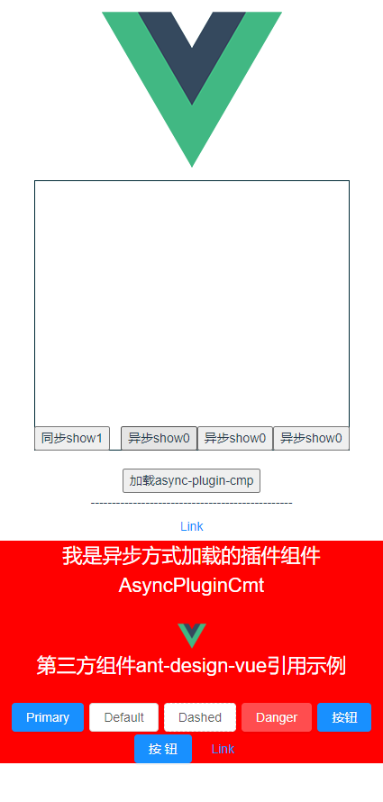

# Vue 异步组件 example项目
## 异步组件示例
示例包括异步加载本地组件、服务器端模板动态渲染

## 开局放大招


## Project setup
```
npm install
```

### Compiles and hot-reloads for development
```
npm run serve
```

### Compiles and minifies for production
```
npm run build
```

### Run your tests
```
npm run test
```

### Lints and fixes files
```
npm run lint
```

### Customize configuration
See [Configuration Reference](https://cli.vuejs.org/config/).


## 说明
### 常规引用组件方式
如， 
``` 
import SyncCmp1 from './components/SyncCmt1' 
...
{
	components: {SyncCmp1}  // 注册
}
```

### 异步加载本地预先写好的组件
如一下3种方式
```
components: {

	// 异步导入组件方式 ①
	'async-cmp0': resolve => {
		// 向 `resolve` 回调传递组件定义
		setTimeout(_ => {
			console.log("开始加载异步组件0: ");
			resolve({
				name: 'AsyncCmp0',
				template: '<div>I am SyncCmp0!</div>',
				mounted() {
					console.log("异步组件0加载完成: ");
				}
			})
		}, 3000)

	},
	// 异步导入组件方式 ②
	'async-cmp1': (resolve, reject) => {
		// 这个特殊的 `require` 语法将会告诉 webpack
		// 自动将你的构建代码切割成多个包，这些包
		// 会通过 Ajax 请求加载
		require(['./components/AsyncCmt1'], resolve)
	},
	// 异步导入组件方式 ③
	'async-cmp2': () => import('./components/AsyncCmt2'), // 这个动态导入会返回一个 `Promise` 对象。
	// 'async-cmp3': () => import('./components/AsyncPluginCmt'), // 这个动态导入会返回一个 `Promise` 对象。
	}
```

### 异步加载服务器端未编译的组件
1. 在服务器端提供供客户端可访问的组件未编译模板
2. 项目中专门封装一个解析其模板(暂时只支持less)，可解析步骤1中的模板

示例如 src/components/Remote.vue

## 附录
### 1. 读取本地文件方式（原理：其实就是通过http请求访问项目的静态文件）
使用npm install 或 yarn add  命令安装vue-resource
在main.js文件中添加： ` import VueResource from 'vue-resource' `

然后：`Vue.use(VueResource)`

最后读取'/public/project.properties' 文件数据：

	```
		this.$http.get('/project.properties').then(res => {
		 console.log("json数据为:" + res.body)//此处的res对象包含了json的文件信息和数据，我们需要的json数据存在于body属性中
		})
	```

或
	```
		import Vue from 'vue'
		// ...
		Vue.http.get('/project.properties').then(res => {
		 console.log("json数据为:" + res.body)//此处的res对象包含了json的文件信息和数据，我们需要的json数据存在于body属性中
		})
	```